[EmberForge-Hunt-Report-Final.md](https://github.com/user-attachments/files/26634573/EmberForge-Hunt-Report-Final.md)
# 🔥 Threat Hunt Report: EmberForge Studios — Source Leak Investigation

**Analyst:** [Your Name]
**Date:** 2026-01-30
**Platform:** Microsoft Sentinel — Workspace: `law-cyber-range`
**Table:** `EmberForgeX_CL`

> 📁 **GitHub Setup:** Upload the `screenshots/` folder alongside this `.md` file. All images use relative paths `screenshots/filename.png`.

---

## Platforms & Tools

| Tool | Purpose |
|---|---|
| Microsoft Sentinel | SIEM — KQL query editor |
| Log Analytics Workspace (`law-cyber-range`) | Data source |
| Sysmon | Process, network, file, registry telemetry |
| Windows Security | Authentication and account events |
| KQL (Kusto Query Language) | All queries |

---

## Scenario

EmberForge Studios, a game development subsidiary, was compromised on **2026-01-30**. The CISO reported a breach and requested immediate investigation. A targeted spear phishing campaign delivered a malicious ISO file disguised as a project review document to employee **Lisa Martin (`lmartin`)**. From initial execution, the attacker achieved full domain compromise within ~2.5 hours, exfiltrating game source code and extracting the Active Directory credential database.

---

## ⚠️ Critical Environment Note

```kql
-- TimeGenerated = ingestion date (Feb 2026) — DO NOT filter on this
-- UtcTime_s     = actual event timestamp (Jan 2026) — ALWAYS use this
-- For Security channel queries: | where TimeGenerated > ago(365d)
-- Time range UI must be set to "Set in query"
```

---

## Key Findings Summary

| # | Finding | Detail |
|---|---|---|
| 1 | **Patient Zero** | `EMBERFORGE\lmartin` on `EC2AMAZ-B9GHHO6` |
| 2 | **Initial Vector** | ISO phishing — `review.dll` via `rundll32.exe` |
| 3 | **C2 Domain** | `cdn.cloud-endpoint.net` → `104.21.30.237` |
| 4 | **Staging Server** | `sync.cloud-endpoint.net:8080` |
| 5 | **Primary Implant** | `C:\Users\Public\update.exe` |
| 6 | **Data Stolen** | `C:\GameDev` → `gamedev.zip` → Mega |
| 7 | **Attacker Account** | `jwilson.vhr@proton.me` / `Summer2024!` |
| 8 | **Credential Theft** | LSASS dump + ntds.dit |
| 9 | **Backdoor Account** | `svc_backup` — Domain Admin |
| 10 | **Hosts Compromised** | All 3 — Workstation, Server, DC |

---

## Environment

```
Start: 2026-01-30 21:00 UTC
End:   2026-01-31 00:00 UTC
```

| Host | Role | IP |
|---|---|---|
| `EC2AMAZ-B9GHHO6.emberforge.local` | Workstation (Patient Zero) | `10.1.173.145` |
| `EC2AMAZ-16V3AU4.emberforge.local` | Server | `10.1.57.66` |
| `EC2AMAZ-EEU3IA2.emberforge.local` | Domain Controller | `10.0.2.69` |

---

## Confirming Access

```kql
EmberForgeX_CL
| where todatetime(UtcTime_s) between (datetime(2026-01-30 21:00) .. datetime(2026-01-31 00:00))
| take 10
```

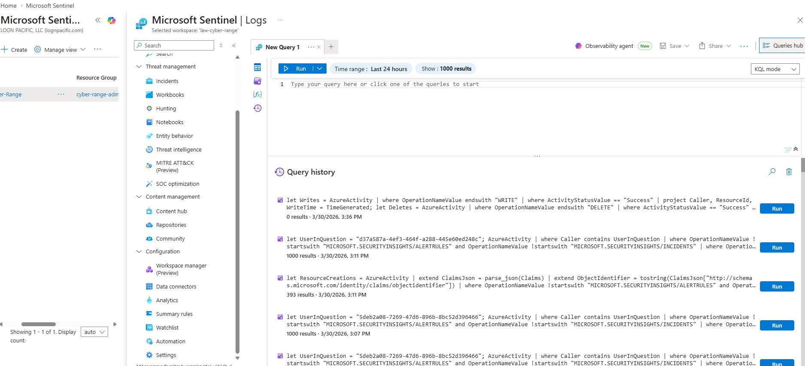

📌 *Table confirmed:* `EmberForgeX_CL` — custom ingested log containing Sysmon and Windows Security events for all three hosts.

---

## Phase 1 — What Was Stolen?

### Data Staging — Compression Activity

```kql
EmberForgeX_CL
| where todatetime(UtcTime_s) between (datetime(2026-01-30 21:00) .. datetime(2026-01-31 00:00))
| where EventCode_s == "1"
| where CommandLine_s has_any ("7z", "zip", "rar", "Compress-Archive", "tar", "compact", "archive", "pack")
        or Image_s has_any ("7z", "zip", "rar", "WinRAR")
| project UtcTime_s, Computer, User_s, CommandLine_s, Image_s, ParentImage_s
| sort by UtcTime_s asc
```

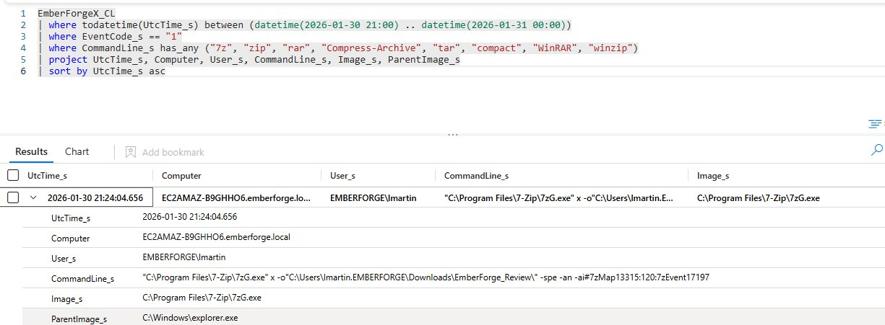

📌 *Source directory confirmed:* `C:\GameDev` archived using built-in PowerShell `Compress-Archive` (Living off the Land). Output: `C:\Users\Public\gamedev.zip`. Parent process `update.exe` — the implant orchestrated this.

---

### rclone — Full Exfiltration Timeline

```kql
EmberForgeX_CL
| where todatetime(UtcTime_s) between (datetime(2026-01-30 21:00) .. datetime(2026-01-31 00:00))
| where EventCode_s == "1"
| where Image_s has "rclone"
        or CommandLine_s has "rclone"
| project UtcTime_s, Computer, User_s, Image_s, CommandLine_s, ParentImage_s, IntegrityLevel_s
| sort by UtcTime_s asc
```

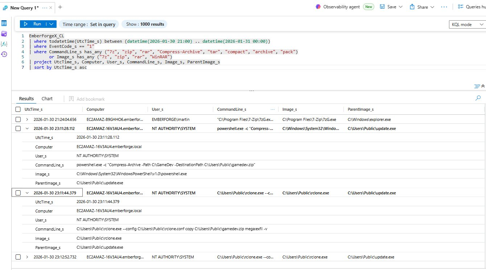

📌 *Full exfil sequence:*
- `23:06:36` — Tool verification
- `23:07:45` — First attempt (failed — config not built)
- `23:08:28` — **Inline credentials exposed**
- `23:10:31` — Password obscured for config
- `23:11:44` / `23:12:52` — Successful uploads to `mega:exfil`

---

### Attacker OPSEC Failure — Credentials in Plaintext

```kql
EmberForgeX_CL
| where todatetime(UtcTime_s) between (datetime(2026-01-30 21:00) .. datetime(2026-01-31 00:00))
| where EventCode_s == "1"
| where CommandLine_s has "rclone"
| where CommandLine_s has "mega-pass"
| project UtcTime_s, Computer, User_s, CommandLine_s
```

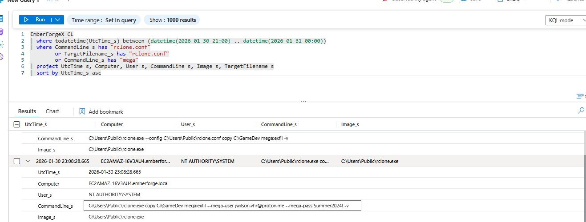

📌 *Credentials captured by Sysmon:*
- **Mega account:** `jwilson.vhr@proton.me`
- **Password (plaintext):** `Summer2024!`
- **Destination:** `mega:exfil`

Attacker passed credentials directly in the command line instead of using a config file. Sysmon EventCode 1 captured every character permanently.

---

### Exfiltration Network Connection Confirmed

```kql
EmberForgeX_CL
| where todatetime(UtcTime_s) between (datetime(2026-01-30 21:00) .. datetime(2026-01-31 00:00))
| where EventCode_s == "3"
| where Image_s has "rclone"
| project UtcTime_s, Computer, Image_s, DestinationIp_s, DestinationPort_s, DestinationHostname_s, Protocol_s
| sort by UtcTime_s asc
```

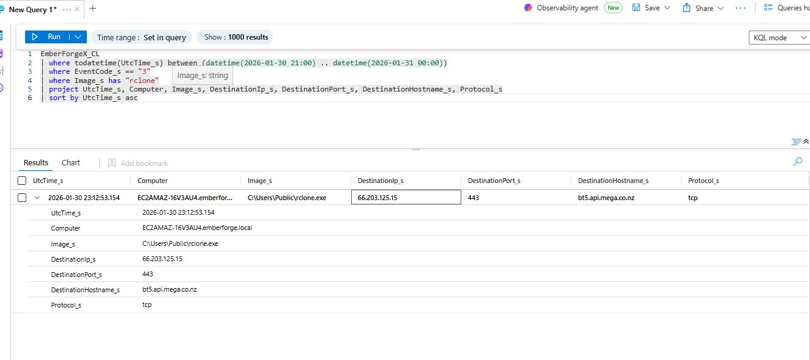

📌 *Exfiltration confirmed:*
- **Destination IP:** `66.203.125.15`
- **Hostname:** `bt5.api.mega.co.nz`
- **Port:** `443` (HTTPS)
- **Time:** `23:12:53` — seconds after final rclone execution

---

## Phase 2 — How Did Data Leave?

### Staging Server — Tool Downloads

```kql
EmberForgeX_CL
| where todatetime(UtcTime_s) between (datetime(2026-01-30 21:00) .. datetime(2026-01-31 00:00))
| where EventCode_s == "1"
| where CommandLine_s has_any (
    "wget", "curl", "Invoke-WebRequest", "iwr",
    "DownloadFile", "DownloadString", "certutil",
    "bitsadmin", "Start-BitsTransfer"
    )
| project UtcTime_s, Computer, User_s, CommandLine_s, Image_s, ParentImage_s
| sort by UtcTime_s asc
```

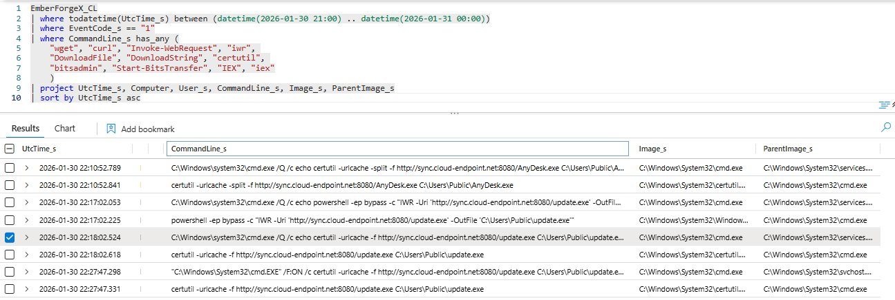

📌 *Staging server confirmed:* `sync.cloud-endpoint.net:8080` — attacker-controlled infrastructure. Tools downloaded via `certutil -urlcache` and `powershell IWR -ep bypass`. Non-standard port 8080 bypasses some firewall rules.

---

### Staging Server — All Three Hosts Reference Same Domain

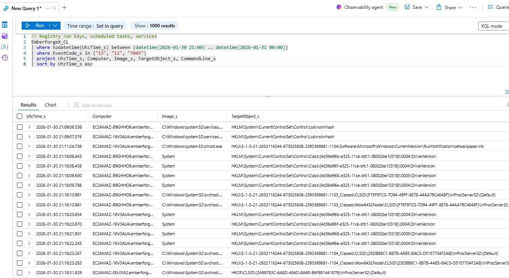

📌 *Same domain across all hosts:* `sync.cloud-endpoint.net` appears in download commands on workstation, server, and DC — single attacker-controlled staging point for entire operation.

---

### AnyDesk — Active Remote Access

```kql
EmberForgeX_CL
| where todatetime(UtcTime_s) between (datetime(2026-01-30 21:00) .. datetime(2026-01-31 00:00))
| where EventCode_s == "3"
| where Image_s has "AnyDesk"
        or CommandLine_s has "AnyDesk"
| project UtcTime_s, Computer, Image_s, DestinationIp_s, DestinationPort_s, DestinationHostname_s
| sort by UtcTime_s asc
```

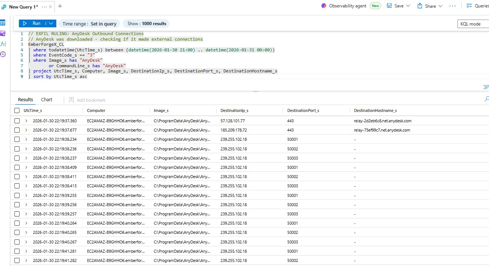

📌 *AnyDesk active on 2 hosts:*
- `EC2AMAZ-B9GHHO6` — session from `22:19:37`
- `EC2AMAZ-16V3AU4` — session from `23:09:42`
- Relay: `relay-2d2eb6c8.net.anydesk.com`, `relay-75ef99c7.net.anydesk.com`, `relay-c6eb91af.net.anydesk.com`

---

### C2 Domain Identified

```kql
EmberForgeX_CL
| where todatetime(UtcTime_s) between (datetime(2026-01-30 21:00) .. datetime(2026-01-31 00:00))
| where EventCode_s == "22"
| where Image_s has_any ("update.exe", "rundll32", "review")
        or QueryName_s has_any ("cloud-endpoint", "sync", "update")
| project UtcTime_s, Computer, User_s, QueryName_s, Image_s
| sort by UtcTime_s asc
```

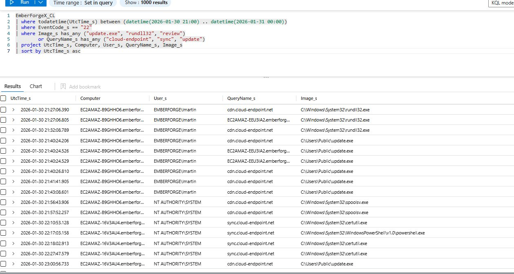

📌 *Two domains identified:*
- `cdn.cloud-endpoint.net` — C2 channel (first hit `21:27:06` by `rundll32.exe`)
- `sync.cloud-endpoint.net` — staging/downloads

C2 IP confirmed from `Raw_s`: `104.21.30.237` — matches `rundll32.exe` beaconing data.

---

## Phase 3 — Where Did It All Start?

### Initial Execution — review.dll

```kql
EmberForgeX_CL
| where todatetime(UtcTime_s) between (datetime(2026-01-30 21:00) .. datetime(2026-01-31 00:00))
| where EventCode_s == "1"
| where Image_s has "rundll32"
| project UtcTime_s, Computer, User_s, CommandLine_s, Image_s, ParentImage_s
| sort by UtcTime_s asc
```

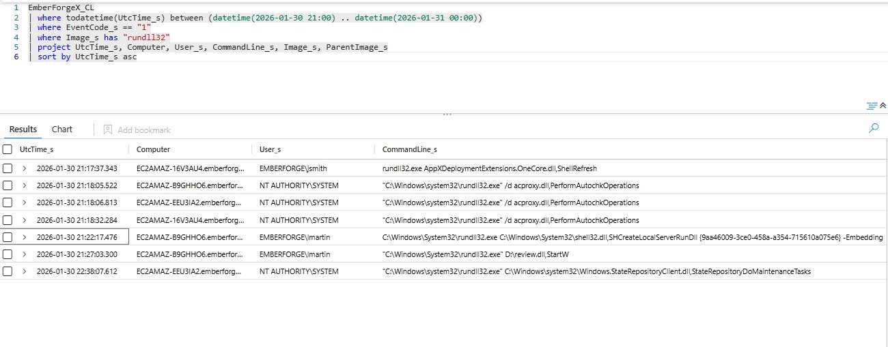

📌 *Patient zero identified:* `EMBERFORGE\lmartin` at `21:27:03`. All other `rundll32.exe` entries are legitimate. Only `D:\review.dll,StartW` is malicious — loaded from `D:` drive (mounted ISO — bypasses MotW/SmartScreen).

---

### review.dll — Expanded Evidence

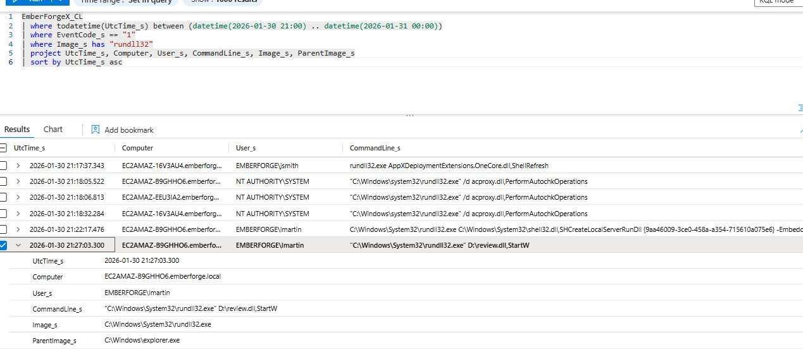

📌 *Execution confirmed:*
- **Time:** `2026-01-30 21:27:03.300`
- **Command:** `"C:\Windows\System32\rundll32.exe" D:\review.dll,StartW`
- **Parent:** `C:\Windows\explorer.exe` — Lisa manually double-clicked
- **Drive:** `D:` — mounted ISO (Mark of the Web bypass)

---

### 7-Zip Extraction — Delivery Chain

```kql
EmberForgeX_CL
| where todatetime(UtcTime_s) between (datetime(2026-01-30 21:00) .. datetime(2026-01-31 00:00))
| where EventCode_s == "1"
| where Computer contains "B9GHHO6"
| where Image_s has_any ("7z", "7zG", "7zip")
        or CommandLine_s has_any ("7z", "7zG", ".7z", " x ")
| project UtcTime_s, Computer, User_s, CommandLine_s, Image_s, ParentImage_s
| sort by UtcTime_s asc
```

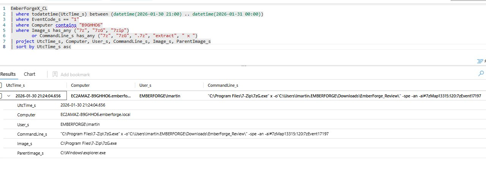

📌 *Delivery chain confirmed:*
```
EmberForge_Review.7z downloaded via Edge (21:22)
    → 7zG.exe extracts to Downloads\EmberForge_Review\ (21:24)
    → ISO mounted → D: drive appears
    → explorer.exe > rundll32.exe D:\review.dll,StartW (21:27)
    → C2 beacon fires 3 seconds later
```

---

## Phase 4 — What Ran on the Workstation?

### Process Injection — EventCode 8

```kql
EmberForgeX_CL
| where todatetime(UtcTime_s) between (datetime(2026-01-30 21:00) .. datetime(2026-01-31 00:00))
| where EventCode_s == "8"
| project UtcTime_s, Computer, User_s, Image_s, SourceImage_s, TargetImage_s
| sort by UtcTime_s asc
```

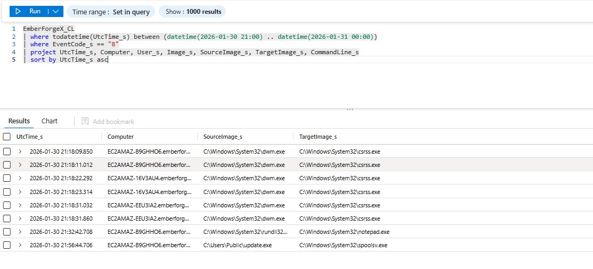

📌 *Two malicious injections confirmed:*
- `21:32:42` — `rundll32.exe` → `notepad.exe` (early stage stealth)
- `21:56:44` — `update.exe` → `spoolsv.exe` (long-term SYSTEM C2)

All `dwm.exe → csrss.exe` entries are legitimate Windows behaviour.

---

## Phase 5 — How Did They Elevate?

### UAC Bypass — fodhelper.exe

```kql
EmberForgeX_CL
| where todatetime(UtcTime_s) between (datetime(2026-01-30 21:00) .. datetime(2026-01-31 00:00))
| where EventCode_s == "1"
| where Image_s has "fodhelper"
        or CommandLine_s has "fodhelper"
| project UtcTime_s, Computer, User_s, CommandLine_s, Image_s, ParentImage_s
| sort by UtcTime_s asc
```

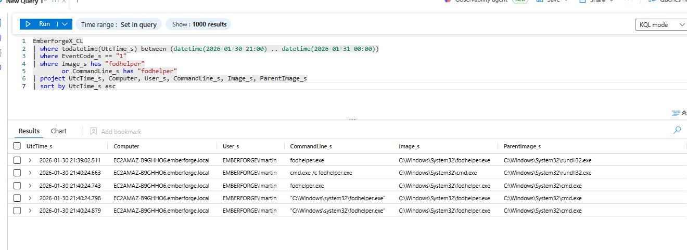

📌 *UAC bypass confirmed (T1548.002):*
1. `21:38:33` — `reg.exe` writes payload to `ms-settings\shell\open\command\(Default)`
2. `21:38:50` — `DelegateExecute` value set (triggers auto-elevation)
3. `21:39:02` — `fodhelper.exe` executes as **SYSTEM** — no UAC prompt shown
4. `21:41:43` — `whoami /priv` confirms SYSTEM via `update.exe`

---

## Phase 6 — Credential Theft

### LSASS Memory Dump

```kql
EmberForgeX_CL
| where TimeGenerated > ago(365d)
| where EventCode_s == "11"
| where TargetFilename_s has_any ("lsass", ".dmp", "dump", ".tmp")
        or TargetFilename_s has_any ("C:\\Windows\\Temp", "C:\\Users\\Public")
| project UtcTime_s, Computer, User_s, Image_s, TargetFilename_s
| sort by UtcTime_s asc
```

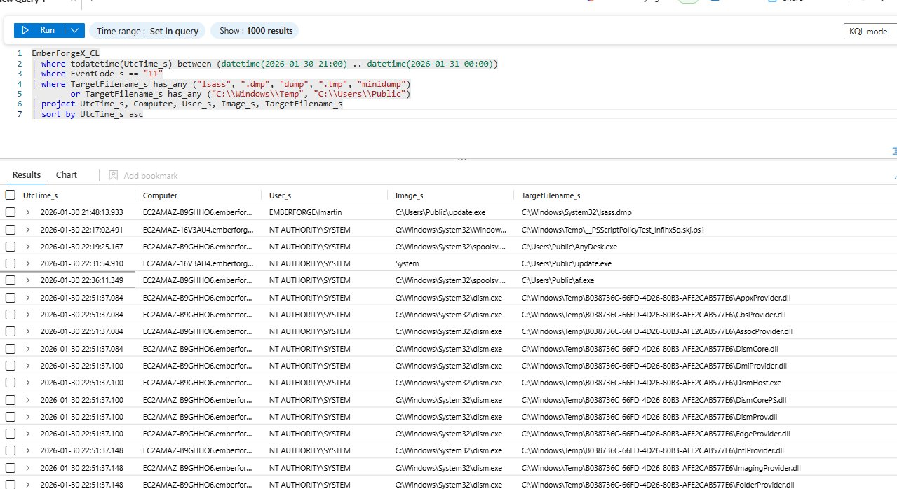

📌 *Multiple critical findings:*
- `21:48:13` — `update.exe` → `C:\Windows\System32\lsass.dmp`
- `22:19:25` — `spoolsv.exe` drops `AnyDesk.exe` (injected process delivering tools)
- `22:36:11` — `spoolsv.exe` drops `af.exe` (staged but not executed)

---

### LSASS Dump — Confirmed

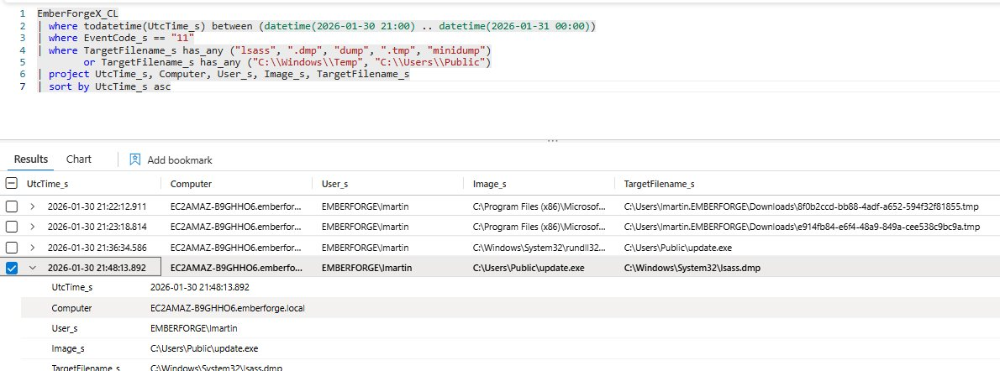

📌 *LSASS dump confirmed:*
- **Process:** `C:\Users\Public\update.exe`
- **Output:** `C:\Windows\System32\lsass.dmp`
- **Technique:** Direct syscalls — no EventCode 10 (bypasses API monitoring)
- **Impact:** All cached domain credentials on workstation compromised

---

## Phase 7 — Discovery & Enumeration

### Domain Enumeration

```kql
EmberForgeX_CL
| where TimeGenerated > ago(365d)
| where EventCode_s == "1"
| where CommandLine_s has_any (
    "net user", "net group", "whoami", "nltest",
    "Get-ADUser", "Get-ADGroup", "dsquery"
    )
| project UtcTime_s, Computer, User_s, CommandLine_s, Image_s, ParentImage_s
| sort by UtcTime_s asc
```

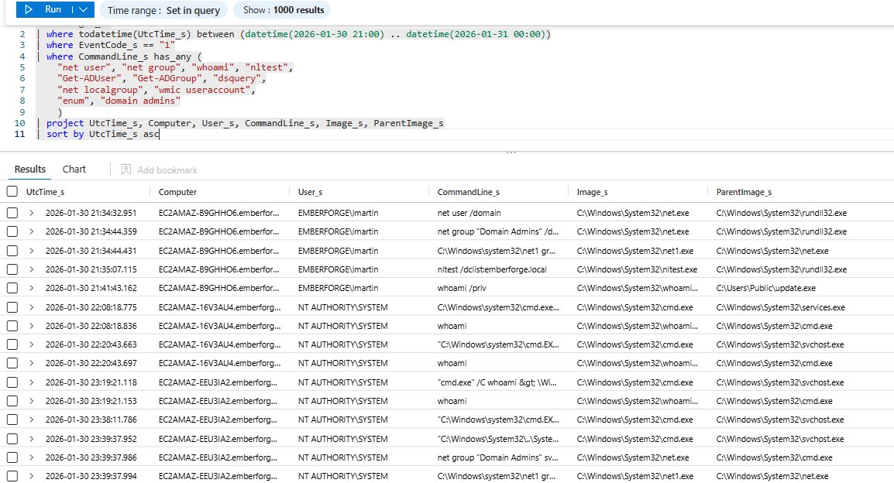

📌 *Full discovery + backdoor sequence captured:*
- `21:34:32` — `net user /domain` — all accounts enumerated
- `21:34:44` — `net group "Domain Admins" /domain` — admins identified
- `21:35:07` — `nltest /dclist:emberforge.local` — DCs discovered
- `23:38:11` — `net user svc_backup P@ssw0rd123! /add /domain` — **backdoor created**
- `23:39:37` — `net group "Domain Admins" svc_backup /add /domain` — **Domain Admin**

---

## Phase 8 — Lateral Movement

### Share Creation & Credential Exposure

```kql
EmberForgeX_CL
| where TimeGenerated > ago(365d)
| where EventCode_s == "1"
| where CommandLine_s has_any ("net share", "\\\\", "admin$", "c$", "netsh", "net use")
| project UtcTime_s, Computer, User_s, CommandLine_s, Image_s, ParentImage_s
| sort by UtcTime_s asc
```

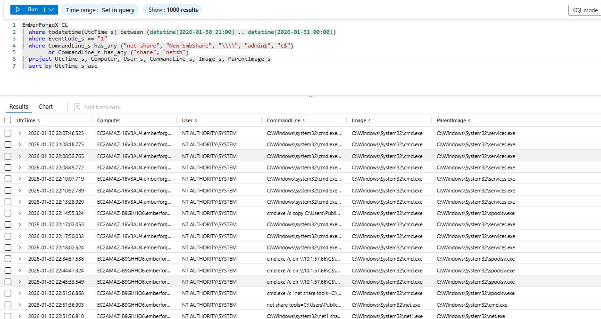

📌 *Three critical findings in one result:*
1. `22:14:55` — `copy update.exe \\10.1.57.66\C$\` — implant pushed via admin share
2. `22:51:36` — `net share tools=C:\Users\Public /grant:everyone,full` — staging share created
3. `22:57:27` — `net use Z: ... /user:EMBERFORGE\Administrator EmberForge2024!` — **Domain Admin password in plaintext**

---

### certutil LotL Abuse on Server

```kql
EmberForgeX_CL
| where TimeGenerated > ago(365d)
| where EventCode_s == "1"
| where Computer contains "16V3AU4"
| where CommandLine_s has_any ("certutil", "IWR", "Invoke-WebRequest")
| project UtcTime_s, Computer, User_s, CommandLine_s, Image_s, ParentImage_s
| sort by UtcTime_s asc
```

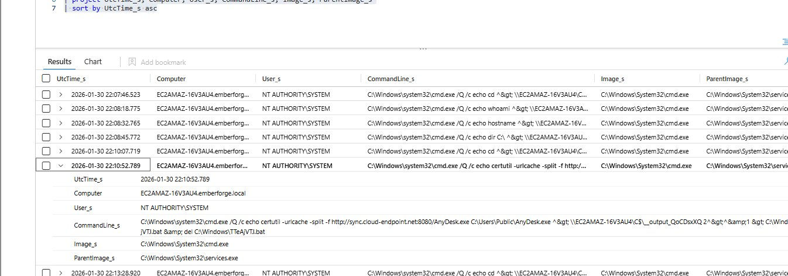

📌 *LotL confirmed on server:* `certutil.exe` downloading `update.exe` from `http://sync.cloud-endpoint.net:8080/update.exe`. Legitimate Windows binary abused to bypass application controls.

---

### Random Named Services — PSExec-Style Execution

```kql
EmberForgeX_CL
| where TimeGenerated > ago(365d)
| where EventCode_s == "13"
| where Computer contains "16V3AU4"
| where TargetObject_s has "Services"
| where TargetObject_s !has "AnyDesk"
| where TargetObject_s !has "Splunk"
| where TargetObject_s !has "WinDefend"
| where TargetObject_s !has "MpsSvc"
| extend ServiceName = tostring(split(TargetObject_s, "\\")[4])
| summarize by UtcTime_s, ServiceName, TargetObject_s
| sort by UtcTime_s asc
```

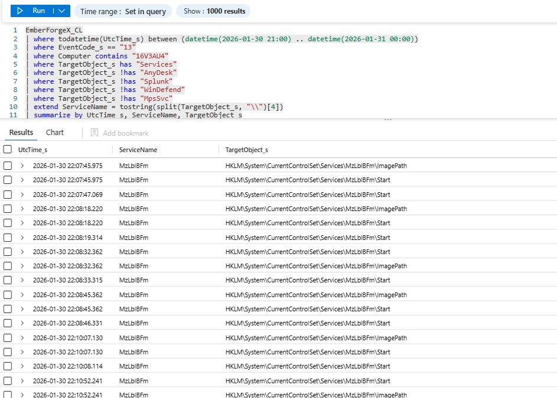

📌 *Impacket psexec-style confirmed:* Three randomly named services (`MzLblBFm`, `QjhJMWqS`, `pGJLIKnC`) on server — classic remote execution via service creation. Multiple services indicate repeated attempts before successful deployment.

---

### NTLM Authentication Failures

```kql
EmberForgeX_CL
| where TimeGenerated > ago(365d)
| where Channel_s == "Security"
| where EventCode_s == "4625"
| project UtcTime_s, Computer, Caller_User_Name_s, src_ip_s, LogonType_s, Raw_s
| sort by UtcTime_s asc
```

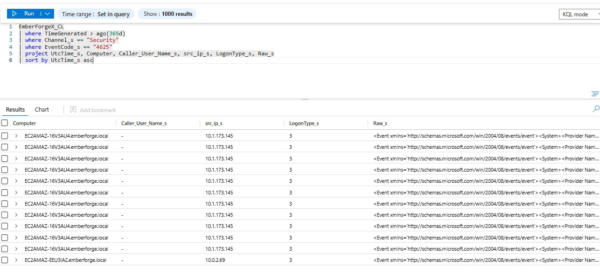

📌 *First lateral movement method failed:* 11 NTLM failures from `10.1.173.145` (workstation) to server before switching to psexec-style. Error `0x80090308` — likely pass-the-hash attempts failing. This forced the attacker to switch techniques.

---

## Phase 9 — Credential Theft Techniques Investigated

Kerberoasting (EventCode 4769), AS-REP Roasting (EventCode 4768), and DCSync (EventCode 4662) were all checked — **no results for any**. The attacker relied solely on direct LSASS dumping and ntds.dit extraction.

> No screenshots included for ruled-out techniques — negative results documented in text only.

---

## Phase 10 — Persistence

### Scheduled Task — WindowsUpdate

```kql
EmberForgeX_CL
| where TimeGenerated > ago(365d)
| where EventCode_s == "1"
| where CommandLine_s has_any ("schtasks", "New-ScheduledTask", "Register-ScheduledTask")
| project UtcTime_s, Computer, User_s, CommandLine_s, Image_s, ParentImage_s
| sort by UtcTime_s asc
```

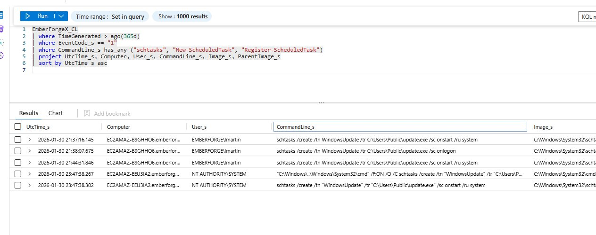

📌 *Persistence confirmed:* Task named `WindowsUpdate` — blends with legitimate Microsoft tasks. Created on workstation (`21:37`) and DC (`23:47`).

---

### Scheduled Task — Expanded

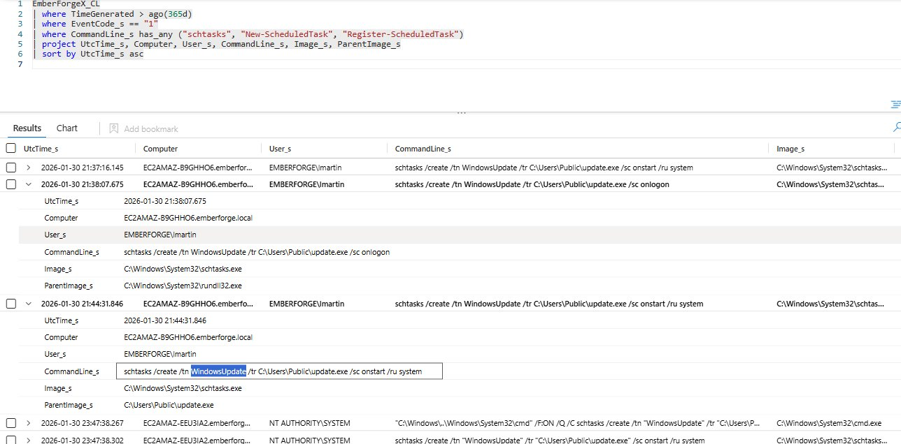

📌 *Task details:*
- **Name:** `WindowsUpdate`
- **Binary:** `C:\Users\Public\update.exe`
- **Triggers:** `onstart` + `onlogon`
- **Privilege:** `SYSTEM`

---

### AnyDesk Config — Unattended Access Enabled

```kql
EmberForgeX_CL
| where TimeGenerated > ago(365d)
| where EventCode_s == "1"
| where CommandLine_s has "AnyDesk"
| where CommandLine_s has_any ("conf", "config", "system.conf")
| project UtcTime_s, Computer, User_s, CommandLine_s, Image_s
| sort by UtcTime_s asc
```

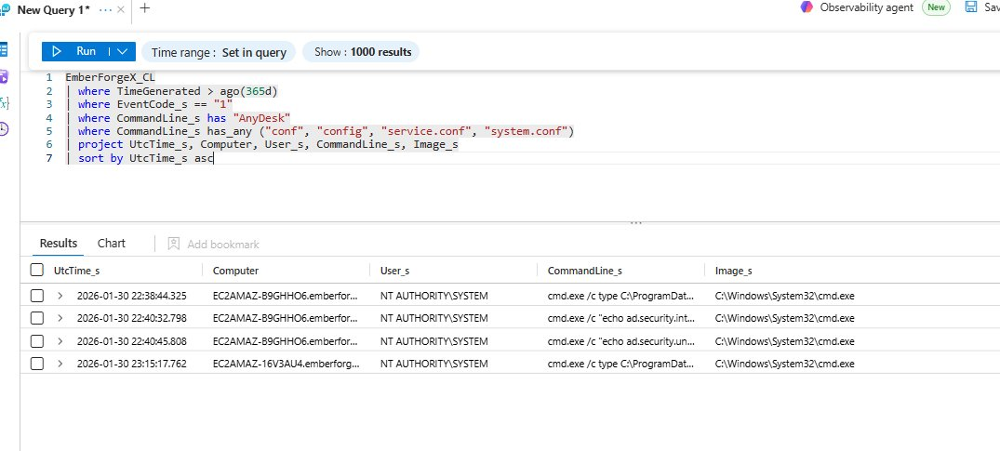

📌 *AnyDesk configured for silent access:*
- **Config:** `C:\ProgramData\AnyDesk\system.conf`
- `ad.security.interactive_access=2` — unattended access enabled
- Password hash `5e884898...` = SHA1 of **`password`**

---

### AnyDesk Startup Folder

```kql
EmberForgeX_CL
| where TimeGenerated > ago(365d)
| where EventCode_s == "11"
| where TargetFilename_s has "Startup"
| project UtcTime_s, Computer, Image_s, TargetFilename_s
| sort by UtcTime_s asc
```

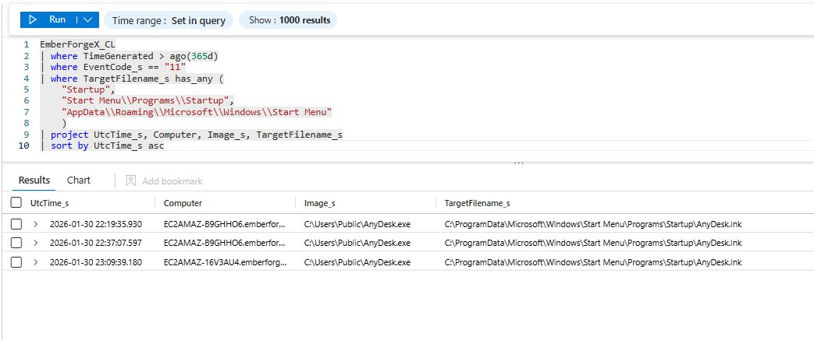

📌 *Startup persistence:* `AnyDesk.lnk` dropped to `C:\ProgramData\Microsoft\Windows\Start Menu\Programs\Startup\` on both workstation and server — launches automatically on every boot.

---

### All Persistence Services — Full Map

```kql
EmberForgeX_CL
| where TimeGenerated > ago(365d)
| where EventCode_s == "13"
| where TargetObject_s has "Services"
| where TargetObject_s !has "AnyDesk"
| where TargetObject_s !has "Splunk"
| where TargetObject_s !has "WinDefend"
| where TargetObject_s !has "MpsSvc"
| extend ServiceName = tostring(split(TargetObject_s, "\\")[4])
| where strlen(ServiceName) == 8
| summarize count() by ServiceName, Computer
| sort by Computer asc
```

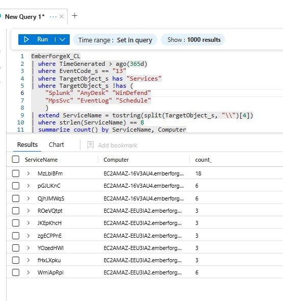

📌 *9 random named services across 2 hosts:*
- **Server:** `MzLblBFm`, `pGJLIKnC`, `QjhJMWqS`
- **DC:** `ROeVQtpt`, `JKEpKhcH`, `zgECPPnE`, `YOzedHWI`, `fHxLXpku`, `WmiApRpl`

---

## Phase 11 — Defence Evasion

### Event Log Clearing on DC

```kql
EmberForgeX_CL
| where TimeGenerated > ago(365d)
| where EventCode_s == "1"
| where CommandLine_s has_any ("wevtutil", "Clear-EventLog", "clearev")
| project UtcTime_s, Computer, User_s, CommandLine_s, Image_s, ParentImage_s
| sort by UtcTime_s asc
```

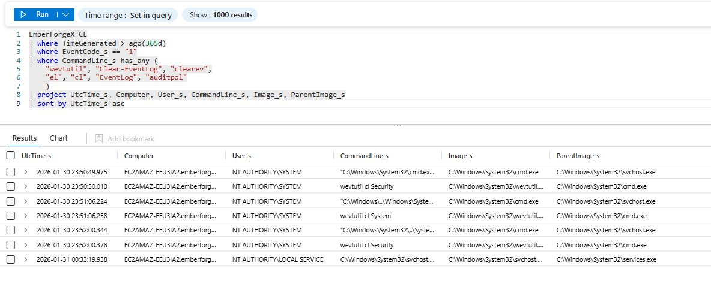

📌 *Evidence destruction:*
- `23:50:50` — `wevtutil cl Security`
- `23:51:06` — `wevtutil cl System`
- `23:52:00` — `wevtutil cl Security` again

**Sysmon survived** — independent channel not cleared.

---

## Phase 12 — Gap Closure

### jsmith — Session Analysis

```kql
EmberForgeX_CL
| where TimeGenerated > ago(365d)
| where EventCode_s == "1"
| where User_s has "jsmith"
        or Caller_User_Name_s has "jsmith"
| project UtcTime_s, Computer, User_s, CommandLine_s, Image_s, ParentImage_s
| sort by UtcTime_s asc
```

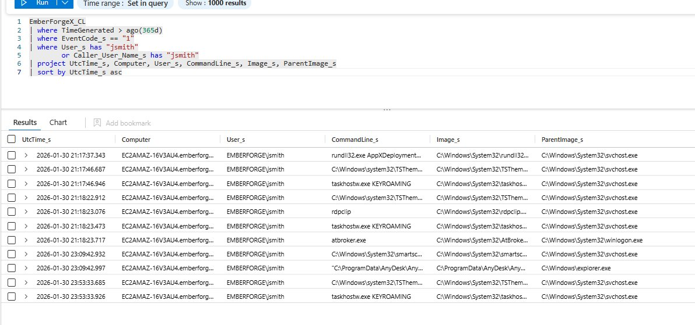

📌 *jsmith session compromised:* Most activity is legitimate RDP session processes. Critical: `23:09:42` — `AnyDesk.exe --control` launched via `explorer.exe` in jsmith's session. Attacker operated AnyDesk through jsmith's credentials. Must be treated as compromised.

---

### IOC Hashes

```kql
EmberForgeX_CL
| where TimeGenerated > ago(365d)
| where EventCode_s == "1"
| where Image_s has_any ("update.exe", "rclone.exe", "AnyDesk.exe")
| project Image_s, SHA256_s
| distinct Image_s, SHA256_s
```

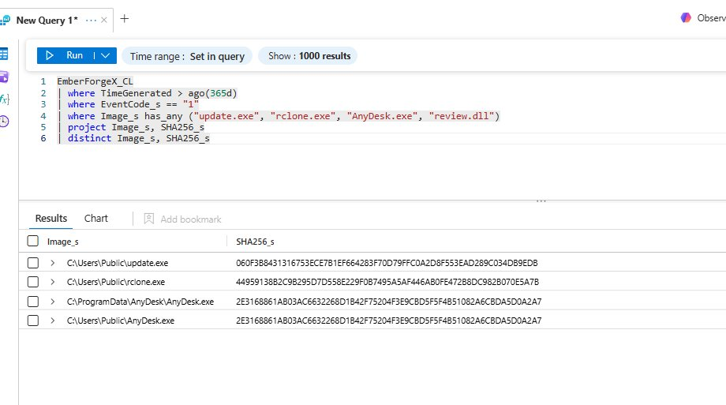

📌 *Hashes collected for threat intel and blocklisting:*

| File | Path | SHA256 |
|---|---|---|
| `update.exe` | `C:\Users\Public\` | `060F3B8431316753ECE7B1EF664283F70D79FFC0A2D8F553EAD289C034DB9EDB` |
| `rclone.exe` | `C:\Users\Public\` | `44959138B2C9B295D7D558E229F0B7495A5AF446AB0FE472B8DC982B070E5A7B` |
| `AnyDesk.exe` | `C:\ProgramData\AnyDesk\` | `2E3168861AB03AC6632268D1B42F75204F3E9CBD5F5F4B51082A6CBDA5D0A2A7` |

---

## Full Attack Timeline

```
21:22:13  lmartin downloads EmberForge_Review.7z via Edge
21:24:04  7zG.exe extracts → Downloads\EmberForge_Review\
21:27:03  explorer.exe > rundll32.exe D:\review.dll,StartW  ← INITIAL EXECUTION
21:27:06  C2 beacon → cdn.cloud-endpoint.net (104.21.30.237)
21:32:42  rundll32.exe injects into notepad.exe
21:34:32  net user /domain — domain mapped
21:35:07  nltest /dclist:emberforge.local — DC discovered
21:36:34  update.exe dropped to C:\Users\Public\
21:37:16  WindowsUpdate scheduled task created
21:38:33  ms-settings registry modified (UAC bypass prep)
21:39:02  fodhelper.exe — SYSTEM achieved, no UAC prompt
21:48:13  update.exe dumps LSASS → C:\Windows\System32\lsass.dmp
21:56:44  update.exe injects into spoolsv.exe (SYSTEM C2)
22:10:52  AnyDesk.exe downloaded from staging server
22:14:55  update.exe copied to server via C$ admin share
22:19:35  AnyDesk installed as service on workstation
22:34:57  Attacker browses \\10.1.57.66\C$\GameDev remotely
22:38:44  AnyDesk system.conf modified — unattended access enabled
22:51:36  net share tools=C:\Users\Public /grant:everyone,full
22:54:09  Firewall rule "SMB" added (port 445)
22:57:27  EmberForge2024! (Domain Admin) captured in plaintext
23:09:38  AnyDesk installed on server
23:11:28  Compress-Archive C:\GameDev → gamedev.zip
23:12:52  rclone uploads gamedev.zip to mega:exfil
23:12:53  Connection confirmed → 66.203.125.15 (bt5.api.mega.co.nz)
23:19:21  DC: whoami confirms SYSTEM
23:35:15  ntds.dit extracted via VSS shadow copy
23:38:11  svc_backup account created on DC
23:39:37  svc_backup added to Domain Admins
23:47:38  WindowsUpdate scheduled task created on DC
23:50:50  wevtutil cl Security — logs cleared
23:51:06  wevtutil cl System — logs cleared
```

---

## Indicators of Compromise

### Network

| Type | Indicator |
|---|---|
| C2 Domain | `cdn.cloud-endpoint.net` |
| Staging Domain | `sync.cloud-endpoint.net:8080` |
| C2 IP | `104.21.30.237` |
| C2 IP | `172.67.174.46` |
| Exfil IP | `66.203.125.15` |
| Exfil Hostname | `bt5.api.mega.co.nz` |
| AnyDesk Relay | `relay-2d2eb6c8.net.anydesk.com` |
| AnyDesk Relay | `relay-75ef99c7.net.anydesk.com` |
| AnyDesk Relay | `relay-c6eb91af.net.anydesk.com` |

### Files

| File | Path |
|---|---|
| Primary implant | `C:\Users\Public\update.exe` |
| Exfil tool | `C:\Users\Public\rclone.exe` |
| Rclone config | `C:\Users\Public\rclone.conf` |
| Remote access | `C:\ProgramData\AnyDesk\AnyDesk.exe` |
| Malicious DLL | `D:\review.dll` |
| LSASS dump | `C:\Windows\System32\lsass.dmp` |
| NTDS copy | `C:\Windows\Temp\nyMdRNSp.tmp` |
| Staged archive | `C:\Users\Public\gamedev.zip` |
| Startup shortcut | `C:\ProgramData\Microsoft\Windows\Start Menu\Programs\Startup\AnyDesk.lnk` |
| Unknown binary | `C:\Users\Public\af.exe` |

### Credentials Captured in Logs

| Account | Password | Context |
|---|---|---|
| `jwilson.vhr@proton.me` | `Summer2024!` | Mega exfil — rclone command line |
| `svc_backup` | `P@ssw0rd123!` | Backdoor Domain Admin — net user |
| `EMBERFORGE\Administrator` | `EmberForge2024!` | Domain Admin — net use |

---

## Evidence Gaps

### DC Log Clearing
At `23:50-23:52` the attacker cleared Security and System logs on the DC using `wevtutil.exe`.

**Lost:** EventCode 4624/4625 logon records, 4720 account creation, 4732 group changes, 7045 service installs.

**Preserved:** Full Sysmon telemetry — independent channel not cleared. All kill chain events reconstructed from Sysmon process creation, file, registry, and network events.

---

## MITRE ATT&CK Mapping

| ID | Technique | Evidence |
|---|---|---|
| T1566.001 | Spearphishing Attachment | `EmberForge_Review.7z` |
| T1553.005 | Mark-of-the-Web Bypass | ISO delivery — D: drive |
| T1218.011 | Rundll32 | `rundll32.exe D:\review.dll,StartW` |
| T1071.001 | Web Protocols C2 | HTTPS → `cdn.cloud-endpoint.net` |
| T1568 | Dynamic Resolution | Cloudflare domain fronting |
| T1055 | Process Injection | `rundll32→notepad`, `update→spoolsv` |
| T1548.002 | Bypass UAC | `fodhelper.exe` + ms-settings |
| T1087.002 | Domain Account Discovery | `net user /domain` |
| T1069.002 | Domain Groups | `net group "Domain Admins"` |
| T1018 | Remote System Discovery | `nltest /dclist` |
| T1021.002 | SMB/Admin Shares | `C$` lateral movement |
| T1569.002 | Service Execution | Random named services |
| T1003.001 | LSASS Memory | `lsass.dmp` |
| T1003.003 | NTDS | `ntds.dit` via VSS |
| T1560.001 | Archive via Utility | `Compress-Archive` |
| T1567.002 | Exfiltration to Cloud | `rclone → Mega` |
| T1053.005 | Scheduled Task | `WindowsUpdate` |
| T1136.002 | Create Domain Account | `svc_backup` |
| T1098 | Account Manipulation | `svc_backup → Domain Admins` |
| T1219 | Remote Access Software | AnyDesk |
| T1070.001 | Clear Event Logs | `wevtutil cl` |

---

## Remediation

### Immediate

| Action | Priority |
|---|---|
| Disable and delete `svc_backup` from AD | 🔴 CRITICAL |
| Reset `EMBERFORGE\Administrator` | 🔴 CRITICAL |
| Full domain password reset | 🔴 CRITICAL |
| Isolate all three hosts | 🔴 CRITICAL |
| Block `cdn.cloud-endpoint.net` + `sync.cloud-endpoint.net` | 🔴 CRITICAL |
| Block `104.21.30.237`, `172.67.174.46`, `66.203.125.15` | 🔴 CRITICAL |
| Remove AnyDesk from all hosts | 🔴 CRITICAL |
| Delete `WindowsUpdate` scheduled tasks | 🔴 CRITICAL |

### Short-Term

| Action | Priority |
|---|---|
| Rebuild all three hosts | 🟠 HIGH |
| Full AD audit — accounts and groups | 🟠 HIGH |
| Double krbtgt password reset | 🟠 HIGH |
| Submit `af.exe` for malware analysis | 🟠 HIGH |
| Block ISO/IMG auto-mount for non-admins | 🟠 HIGH |

### Long-Term

| Action | Priority |
|---|---|
| Real-time log forwarding to immutable SIEM | 🟡 MEDIUM |
| Enable Credential Guard | 🟡 MEDIUM |
| Block `certutil.exe` outbound connections | 🟡 MEDIUM |
| Implement MFA for all domain accounts | 🟡 MEDIUM |
| User awareness training — ISO phishing | 🟡 MEDIUM |

---

## Can We Contain?

**NO** — not until all immediate actions are complete simultaneously.

Five active persistence mechanisms remain:
1. `svc_backup` in Domain Admins — **survives machine rebuilds**
2. AnyDesk services active — **remote access right now**
3. `WindowsUpdate` scheduled tasks — **survives reboots**
4. `ntds.dit` extracted — **all domain creds compromised offline**
5. AnyDesk startup shortcuts — **launches on every boot**

---

## Lessons Learned

### For the Blue Team

**1. ISO phishing bypasses your perimeter controls.**
SmartScreen and Mark-of-the-Web don't apply to files inside mounted ISOs. A user double-clicking a file on a virtual D: drive gets zero warnings. Block ISO/IMG auto-mounting for non-admin users via Group Policy — this kills the entire delivery chain before it starts.

**2. Sysmon saved this investigation. Native Windows logs did not.**
The attacker cleared the Security and System logs on the DC. If Sysmon wasn't deployed, the DC timeline would be a black hole. Native Windows logging alone is not sufficient for incident response. Deploy Sysmon everywhere — including DCs.

**3. `C:\Users\Public\` is a red flag you should be alerting on.**
Every single malicious binary in this attack — `update.exe`, `rclone.exe`, `AnyDesk.exe`, `af.exe` — was dropped to `C:\Users\Public\`. This directory requires no admin rights to write to. An alert on any executable created or run from this path would have flagged the attack within minutes of the first execution.

**4. Legitimate tools are your biggest detection blind spot.**
`certutil`, `rundll32`, `schtasks`, `net.exe`, `vssadmin`, `wevtutil`, `Compress-Archive` — every tool in this attack is a Microsoft-signed Windows binary. Signature-based detection is useless here. You need behavioural detection — `certutil` making outbound HTTP requests is not normal. `rundll32` loading a DLL from a non-system drive is not normal. Build detections around behaviour, not file signatures.

**5. Credentials in command line logs are a gift — but only if you're collecting them.**
Three plaintext passwords were captured by Sysmon because Sysmon logs full command lines. If you only have basic Windows process auditing without command line logging enabled, all three of those credentials would have been invisible. Verify your Sysmon config captures `CommandLine` on EventCode 1.

**6. TimeGenerated vs UtcTime_s almost broke this entire hunt.**
Custom log ingestion into Sentinel sets `TimeGenerated` to the ingestion date — not the event date. If every query had filtered on `TimeGenerated` instead of `UtcTime_s`, the investigation would have returned nothing. Document this for your team. Any custom log table in Sentinel needs this validated on day one.

---

### For the Attacker (OPSEC Failures That Got Them Caught)

Documenting attacker mistakes is equally valuable — it shows what detection looked like from their side.

| Mistake | Impact |
|---|---|
| Passed `--mega-pass Summer2024!` in command line | Password captured permanently in Sysmon logs |
| Used `net user svc_backup P@ssw0rd123! /add` | Backdoor password captured in logs |
| Used `net use ... /user:Administrator EmberForge2024!` | Domain Admin password captured in logs |
| Only cleared Security + System logs — not Sysmon | Entire kill chain survived in Sysmon channel |
| Staged all tools in `C:\Users\Public\` | Single high-signal directory for detection |
| Used the same staging domain across all three hosts | Single IOC blocks entire infrastructure |
| Named the scheduled task `WindowsUpdate` | Obvious enough to any analyst who looked |

---

### Detection Opportunities Missed

These are the points where a detection rule would have stopped or flagged the attack earlier:

| Time | Event | Detection Rule That Would Have Caught It |
|---|---|---|
| `21:24:04` | 7zip extracts to Downloads | Alert: archive extraction followed by DLL in user profile |
| `21:27:03` | `rundll32.exe` loads DLL from `D:\` | Alert: rundll32 loading DLL from non-system drive |
| `21:37:16` | `schtasks /create /tn WindowsUpdate` | Alert: scheduled task creation from non-standard parent |
| `21:38:33` | `reg.exe` writes to `ms-settings` | Alert: ms-settings shell command registry modification |
| `21:48:13` | `update.exe` creates `lsass.dmp` | Alert: non-system process creating .dmp in System32 |
| `22:51:36` | `net share tools ... /grant:everyone,full` | Alert: world-readable share created by non-admin process |
| `22:57:27` | `net use` with plaintext credentials | Alert: net use command containing `/user:` flag |
| `23:35:15` | `copy ... ntds.dit ...` | Alert: any process accessing ntds.dit path |
| `23:50:50` | `wevtutil cl Security` | Alert: event log clearing — immediate escalation |

---

**Report Status:** ✅ All flags investigated and confirmed
**Hunt Platform:** Microsoft Sentinel — EmberForge Cyber Range
